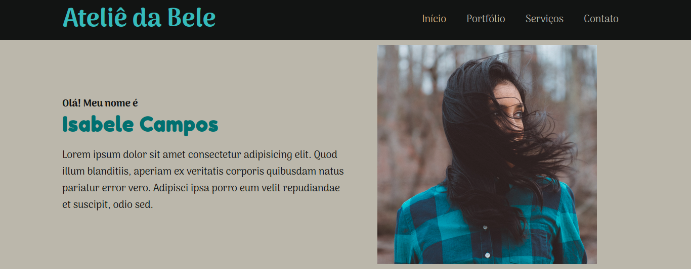

# Ateliê da Bele

Este projeto apresenta um site responsivo estilo One Page utilizando a extensão *Sass*, um pré-processador CSS. São aplicados recursos como armazenamento de dados em variáveis, aninhamento de CSS, uso de *loops* nos estilos e criação de *mixins*.

O negócio apresentado é o Ateliê da Bele. Assim, é apresentada uma seção sobre a dona do negócio, portfólio, serviços prestados e as informações de contato.

##  :gear: Tecnologias

- HTML
- SASS
- CSS

##  :art: Layout

